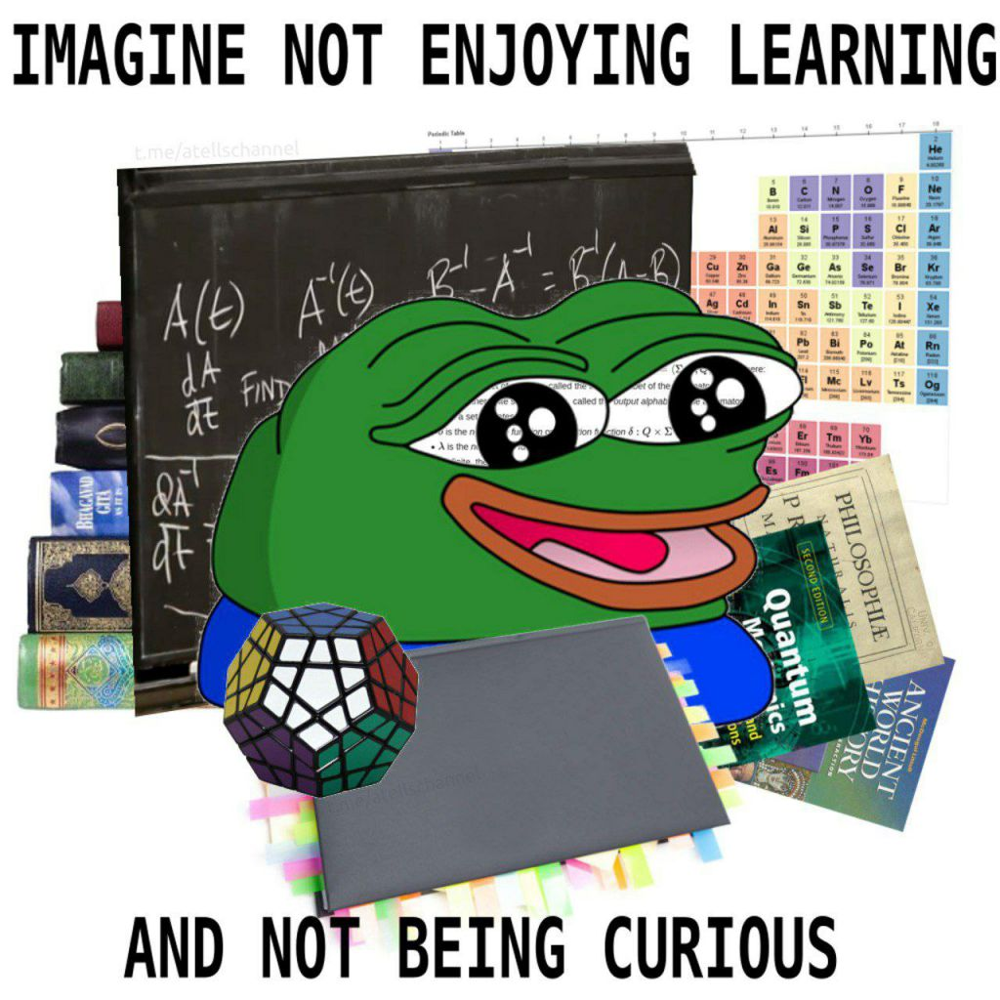

- Tente gastar abaixo do que poderia
- Toda economia de agora é um alívio na emergência/oportunidade do futuro
- Conhecimento é o investimento mais valioso
	- 
- Evite ao máximo a [[ânsia de ter e o tédio de possuir]]
	- Valorize suas conquistas vivendo-as
- Seu dinheiro equivale a tempo que foi aplicado no seu trabalho, faça valer o esforço
- É muito mais fácil tomar decisões com dinheiro disponível do que sem
- [[disciplina dói no começo, o arrependimento dói todo dia]]